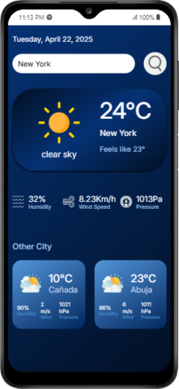

# 🌤️ Weather App

A sleek and responsive weather application that allows users to get real-time weather data by entering a city name. The app displays key weather metrics like temperature, humidity, wind speed, and pressure, with support for displaying multiple cities' weather details.

---

## 📸 Demo



---

## 🔍 Features

- 🌆 Search for weather by city name
- 🌡️ Displays current temperature, weather description, humidity, wind speed, and pressure
- 📅 Displays today's date in a user-friendly format
- 🌍 Shows weather for multiple cities (e.g., Canada, Abuja)
- 🎨 Beautiful and responsive UI with weather-based icons

---

## ⚙️ Technologies Used

- HTML5
- CSS3
- JavaScript 
- [OpenWeatherMap API](https://openweathermap.org/api)

---

## 📁 Project Structure

```
📦 weather-app/
 ┣ 📁 images/
 ┃ ┣ 🌤️ clear.png
 ┃ ┣ ☁️ clouds.png
 ┃ ┣ 🌧️ rain.png
 ┃ ┣ 🌫️ mist.png
 ┃ ┣ 🌦️ drizzle.png
 ┃ ┣ ❄️ snow.png
 ┃ ┣ 💨 wind.png
 ┃ ┣ 💧 humidity.png
 ┃ ┣ 📊 barometer.png
 ┃ ┗ 🔍 search.png
 ┣ 📄 index.html
 ┣ 📄 style.css
 ┣ 📄 main.js
 ┣ 📄 config.js (contains your API key)
 ┗ 📄 README.md
```

---

## 🚀 Getting Started

### 1. Clone the Repository

```bash
git clone https://github.com/Emmanuelahdamilola/weather-app.git
cd weather-app
```

### 2. Setup API Key

- Sign up at [OpenWeatherMap](https://openweathermap.org/) to get your free API key.
- Create a `config.js` file in the root directory and paste the following:

```javascript
const API_KEY = "your_api_key_here";
```

### 3. Open the App

- Simply open `index.html` in your browser to use the app.

---

## 📌 Usage Instructions

- Enter the name of any city and click the search icon.
- The app will display real-time weather information for that city.
- Other cities like Canada and Abuja are automatically displayed in mini cards.

---

## 🖼️ Weather Conditions & Icons

| Condition | Icon            |
|----------|------------------|
| Clear    | `clear.png`      |
| Clouds   | `clouds.png`     |
| Rain     | `rain.png`       |
| Drizzle  | `drizzle.png`    |
| Mist     | `mist.png`       |
| Snow     | `snow.png`       |

---

## 🛠️ Future Improvements

- Add geolocation-based weather
- Add hourly or weekly forecast
- Store recent search history
- Allow dark/light mode toggle

---

## 🙌 Acknowledgements

- [OpenWeatherMap API](https://openweathermap.org/)
- Icons from various public sources
- Fonts from [Google Fonts](https://fonts.google.com/)

---

## 📄 License

This project is open-source and available under the [MIT License](LICENSE).

---

## 👩🏽‍💻 Author

**Emmanuelah Damilola**  